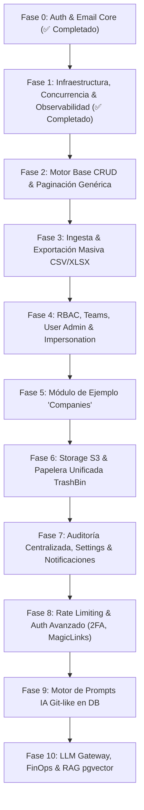

# 🗺️ Master Roadmap & Arquitectura: `fastapi_plantilla`

Este documento define la hoja de ruta, arquitectura de módulos y especificaciones técnicas para el desarrollo completo de `fastapi_plantilla` (backend modular de alto rendimiento para proyectos empresariales CRUD + IA).

---

## 🏛️ 1. Principios de Diseño & Estándares Técnicos

1. **Filosofía Ponytail (Simplicidad Radical & Cero Grasa):** 
   - Biblioteca estándar y capacidades nativas de PostgreSQL primero.
   - Sin sobreingeniería, sin factories innecesarias ni dependencias pesadas.
2. **Código Autoexplicativo & Cero Grasa Documental (No Sobreexplicar):**
   - El código debe ser limpio, directo y autoexplicativo a través de sus nombres, tipos y estructura.
   - Evitar comentarios obvios, redundancias y descripciones innecesarias en esquemas y campos cuando el nombre ya es explícito.
3. **Polimorfismo Universal (`entity_type` + `entity_id`):** 
   - Patrón único y consistente para vincular Documentos S3, Papelera, Logs de Auditoría, Notificaciones y Plantillas de Prompts IA a cualquier entidad de negocio sin acoplamientos rígidos.
4. **Calidad & Robustez:**
   - **Tipado estricto:** 100% verificado con Mypy estricto.
   - **Linter & Formatter:** Ruff.
   - **Seguridad:** Hashing Argon2id, HMAC-SHA256 en tiempo constante, sesiones en BD y compatibilidad total con SSR (Cookies `HttpOnly` + Bearer Tokens).
   - **Base de Datos:** SQLAlchemy 2.0 Asíncrono + UUIDv7 nativos + Alembic migrations.

---

## 📊 2. Diagrama de Fases y Dependencias

---

## 📋 3. Desglose Detallado de Fases

### 🟢 FASE 0: Autenticación Base & Email Engine *(COMPLETADO)*
* **Descripción:** Registro/Login por email, Google OAuth OIDC, reseteo/verificación de correo, sesiones en BD con HMAC-SHA256, cookies HttpOnly SSR y motor de emails (Builder fluido + Jinja2 + Transports SMTP/Resend).
* **Modelos:** `auth_users`, `auth_accounts`, `auth_sessions`, `auth_verifications`.
* **Problema que soluciona:** Proporciona la identidad segura del usuario y la comunicación por correo sin frameworks pesados de terceros.

---

### 🟢 FASE 1: Infraestructura Transversal, Observabilidad & Concurrencia *(COMPLETADO)*
* **1.1 Middleware Request ID Tracing (`X-Request-ID`):**
  * *Descripción:* Inyección de UUIDv7 en cada request propagado a logs, auditoría y headers de respuesta.
  * *Problema que soluciona:* Elimina el caos en producción al depurar errores; vincula cualquier fallo HTTP a una traza única de base de datos e IA.
* **1.2 Healthchecks Inteligentes (Liveness & Readiness Probes):**
  * *Descripción:* Endpoints `/api/health/live` (proceso vivo) y `/api/health/ready` (ping con timeout a PostgreSQL).
  * *Problema que soluciona:* Los orquestadores (Docker / Kubernetes / Render) sabrán exactamente si la app está lista para recibir tráfico o si la base de datos se cayó.
* **1.3 Mixins Comunes & Concurrencia Optimista:**
  * *Descripción:* `RecordStatus` enum (`ACTIVE`, `PENDING`, `TRASHED`, `INACTIVE`, `ARCHIVED`, `SUSPENDED`), `TimestampMixin`, `AuditFieldsMixin`, `OptimisticLockMixin` (`version: int`), `OwnedMixin` y `PolymorphicTargetMixin`.
  * *Problema que soluciona:* Evita que dos usuarios modifiquen el mismo registro al mismo tiempo y se pisen cambios sin advertencia (`HTTP 409 Conflict`), estandarizando el modelo de datos.

---

### 🧱 FASE 2: Capa Base CRUD & Paginación Genérica (Core Engine)
* **2.1 Servicios y Repositorios Genéricos:** *(COMPLETADO)*
  * *Descripción:* `BaseRepository[T]`, `BaseCRUDService[T]`, `BaseAuditService[T]` y `BaseOwnedService[T]` sobre SQLAlchemy 2.0 asíncrono con blindaje de seguridad completo (Fail-closed RBAC, anti-oráculo 404, mitigación DoS y mass assignment).
  * *Problema que soluciona:* Evita escribir el 80% del código boilerplate en nuevos módulos garantizando aislamiento multitenant.
* **2.2 Paginación y Envelopes Estándar:** *(COMPLETADO)*
  * *Descripción:* `PaginationParams` y `PaginatedResponse[T]` con metadatos: `{ data: [...], meta: { page, limit, total, totalPages, hasNext, hasPrev } }` y límites anti-DoS (`page <= 1000`, `search <= 100`).
  * *Problema que soluciona:* Homogeniza todas las respuestas de listas para que los frontends (Next.js, React, Vue, Svelte) consuman una sola estructura predecible.
* **2.3 Base Router Factory (FastAPI Router Generator):**
  * *Descripción:* Generador dinámico de rutas estándar: CRUD individual, operaciones `/bulk` (crear, soft-delete, restore, permanent) y `/list` ultraligero para dropdowns.
  * *Problema que soluciona:* Crear una nueva entidad de negocio pasa de requerir días a tomar menos de 10 minutos.

---

### 📊 FASE 3: Motor de Ingesta & Exportación Masiva (CSV & Excel)
* **3.1 Motor de Exportación Avanzada:**
  * *Descripción:* Conversor a CSV y `.xlsx` (OpenPyXL) con resolución de caminos anidados (ej. `team.name`), selección de columnas y headers `Content-Disposition`.
  * *Problema que soluciona:* Permite descargar cualquier tabla filtrada en tiempo real sin librerías frontend pesadas.
* **3.2 Importador Masivo con Validación Fila por Fila:**
  * *Descripción:* `GET /{resource}/import-template` (descarga plantilla Excel) y `POST /{resource}/import` (valida filas contra esquemas Pydantic).
  * *Problema que soluciona:* Ingesta masiva segura de datos para clientes, devolviendo reportes de errores claros (*"Fila 12: NIF inválido"*).

---

### 🔐 FASE 4: Sistema RBAC, Equipos (Teams), Usuarios & Impersonation
* **4.1 Catálogo de Módulos & Roles (`sys_modules`, `rbac_roles`, `rbac_role_permissions`):**
  * *Descripción:* Matriz de permisos con 8 acciones (`CREATE`, `READ`, `UPDATE`, `DELETE`, `RESTORE`, `EXPORT`, `IMPORT`, `SETTINGS`) y 3 scopes jerárquicos (`GLOBAL` > `TEAM` > `OWN`).
  * *Problema que soluciona:* Control de acceso granular empresarial y multitenant dinámico en base de datos.
* **4.2 Módulo de Equipos / Organizaciones (`modules/team`):**
  * *Descripción:* Modelos `Team` y `TeamUser`. Gestión de miembros y asignación polimórfica de roles a equipos completos.
  * *Problema que soluciona:* Facilita la colaboración corporativa; un usuario hereda automáticamente los permisos de todos sus equipos.
* **4.3 Gestión Administrativa de Usuarios (`modules/users`):**
  * *Descripción:* Listado paginado, suspensión/reactivación individual y masiva (`/bulk/suspend`), asignación de roles y reenvío de invitaciones.
  * *Problema que soluciona:* Panel de control completo para gobernar cuentas de usuario.
* **4.4 Impersonation ("Login As" para Soporte):**
  * *Descripción:* Endpoint `POST /api/auth/impersonate/{user_id}` para SuperAdmins con auditoría estricta.
  * *Problema que soluciona:* Permite a soporte técnico ver exactamente lo que ve un usuario para reproducir errores sin pedirle su contraseña.

---

### 🏢 FASE 5: Módulo de Ejemplo de Negocio (`modules/companies`)
* **5.1 Entidad `Company`:**
  * *Descripción:* Implementación de referencia con `name`, `nif`, `sector`, `owner_id`, `status` y auditoría completa.
  * *Problema que soluciona:* Valida en un caso real el funcionamiento de los filtros de Scope RBAC, la papelera, exportación y bulk actions.

---

### 📁 FASE 6: Almacenamiento S3 / MinIO & Papelera Unificada
* **6.1 Módulo de Storage (`modules/storage`):**
  * *Descripción:* Modelo polimórfico `Document` (`entity_type`, `entity_id`). Generación de Presigned URLs (Upload/Download), confirmación de subida, metadatos y descarga empaquetada en ZIP.
  * *Problema que soluciona:* Carga segura de archivos directos a S3 sin saturar el ancho de banda del servidor backend.
* **6.2 Papelera de Reciclaje Centralizada (`modules/trash`):**
  * *Descripción:* Modelo `sys_trash_bin` con retención temporal (`expires_at`, ej. 30 días), vista unificada de elementos borrados, restauración individual/masiva y purga definitiva.
  * *Problema que soluciona:* Recuperación de desastres ante borrados accidentales de usuarios.
* **6.3 Background Trash Purge Job:**
  * *Descripción:* Lifespan scheduler periódico (cada 24h) para purga automática de registros caducados.
  * *Problema que soluciona:* Mantenimiento automático de la base de datos sin acumular basura.

---

### 📋 FASE 7: Auditoría Centralizada, Settings Dinámicos & Notificaciones
* **7.1 Módulo de Auditoría (`modules/audit`):**
  * *Descripción:* Tabla `sys_audit_logs` con registro de acciones (`CREATE`, `UPDATE`, `LOGIN`, etc.), diffs `before`/`after`, IP, User-Agent y ofuscación de datos sensibles (`[REDACTED]`).
  * *Problema que soluciona:* Cumplimiento de normativas de seguridad (ISO 27001 / GDPR) y trazabilidad completa de cambios.
* **7.2 Settings Dinámicos & Feature Flags (`sys_settings`):**
  * *Descripción:* Configuración clave-valor en BD con scopes (`GLOBAL` o por `entity_type`/`entity_id`).
  * *Problema que soluciona:* Modificar parámetros (modo mantenimiento, límites de tamaño, activar betas) en caliente sin redeploy.
* **7.3 Notificaciones In-App (`sys_notifications`):**
  * *Descripción:* Campanita 🔔 de notificaciones polimórficas (`entity_type`, `entity_id`) para eventos asíncronos o alertas.
  * *Problema que soluciona:* Avisar al usuario cuando terminan procesos largos (exportación lista, documento procesado por IA).

---

## 🛡️ FASE 8: Seguridad Global & Autenticación Avanzada
* **8.1 Rate Limiting Global & Security Headers:**
  * *Descripción:* Limitador de peticiones anti-fuerza bruta en login y endpoints sensibles + cabeceras de seguridad HTTP (HSTS, CSP, etc.).
  * *Problema que soluciona:* Protección contra ataques DoS y scraping malicioso.
* **8.2 Magic Links (Passwordless Login):**
  * *Descripción:* Flujo de login por enlace temporal directo al correo sin contraseña.
  * *Problema que soluciona:* Experiencia de usuario ágil y moderna.
* **8.3 Doble Factor de Autenticación (2FA / TOTP):**
  * *Descripción:* Códigos QR con `pyotp` para Google Authenticator / Authy + códigos de recuperación.
  * *Problema que soluciona:* Seguridad de grado corporativo para cuentas críticas y administradores.
* **8.4 API Keys & Email Logs:**
  * *Descripción:* Modelo `Key` para integración programática con scripts externos + tabla `email_logs` para auditar envíos.
  * *Problema que soluciona:* Interoperabilidad B2B y diagnóstico de correos rebotados o fallidos.

---

### 🧠 FASE 9: Motor de Prompts IA en DB con Versionado Git (`modules/ai_prompts`)
* **9.1 Plantillas Polimórficas (`ai_prompt_templates`):**
  * *Descripción:* Registro con `slug`, `category`, `entity_type` y `entity_id`. Soporta resolución en cascada (busca el prompt específico de la Entidad/Compañía y si no existe, cae al `GLOBAL` default).
  * *Problema que soluciona:* Permite tener comportamientos de IA personalizados por cliente (ej. un OCR diferente por empresa) sin tocar código.
* **9.2 Versiones Inmutables Tipo Git (`ai_prompt_versions`):**
  * *Descripción:* Commits de prompts con `system_prompt`, `user_prompt`, `few_shot_examples`, `commit_message`, estados (`DRAFT`, `ACTIVE`, `ARCHIVED`), endpoint de **Diff** y endpoint de **Rollback**.
  * *Problema que soluciona:* Control de versiones, pruebas seguras de prompts desde el frontend y capacidad de volver atrás al instante si un prompt empeora.
* **9.3 Trazabilidad y Auditoría de Ejecuciones (`sys_ai_executions`):**
  * *Descripción:* Registro de cada llamada al LLM vinculando la versión exacta del prompt, variables inyectadas, modelo, latencia, tokens, coste (\$ USD) y salida estructurada.
  * *Problema que soluciona:* Trazabilidad absoluta de por qué la IA respondió lo que respondió y auditoría de costes.

---

### ⚡ FASE 10: LLM Multi-Provider Gateway, FinOps & RAG Vectorial (`modules/ai_engine`)
* **10.1 Gateway Agnóstico de LLMs con Pydantic Structured Outputs:**
  * *Descripción:* Conector unificado para Google Gemini, OpenAI, Anthropic y Ollama/DeepSeek con reintentos y fallback automático. Salidas 100% tipadas en esquemas Pydantic.
  * *Problema que soluciona:* Cero dependencia de un solo proveedor de IA y respuestas garantizadas en formato JSON válido.
* **10.2 FinOps & Control de Cuotas de IA:**
  * *Descripción:* Límites mensuales de gasto/tokens configurables por Empresa o Equipo.
  * *Problema que soluciona:* Previene facturas sorpresa de OpenAI/Gemini por bucles o abusos.
* **10.3 Soporte Vectorial Nativo para RAG (`pgvector`):**
  * *Descripción:* Extensión `pgvector` en PostgreSQL para almacenar embeddings de documentos (`modules/storage`) y realizar búsquedas semánticas.
  * *Problema que soluciona:* Implementar RAG (chatear con documentos) directamente en la misma base de datos sin costes de servicios externos (Pinecone, etc.).
