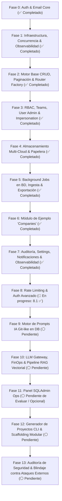

# 🗺️ Master Roadmap & Arquitectura: `fastapi_plantilla`

Este documento define la hoja de ruta, arquitectura de módulos y especificaciones técnicas para el desarrollo completo de `fastapi_plantilla` (backend modular de alto rendimiento para proyectos empresariales CRUD + IA).

---

## 🏛️ 1. Principios de Diseño & Estándares Técnicos

1. **Filosofía Ponytail (Simplicidad Radical & Cero Grasa):** 
   - Biblioteca estándar y capacidades nativas de PostgreSQL primero.
   - Sin sobreingeniería, sin factories innecesarias ni dependencias pesadas.
2. **Código Autoexplicativo & Cero Grasa Documental (No Sobreexplicar):**
   - El código debe ser limpio, directo y autoexplicativo a través de sus nombres, tipos y estructura.
   - Evitar comentarios obvios, redundancias y descripciones innecesarias en esquemas y campos cuando el nombre ya es explícito.
3. **Polimorfismo Universal (`entity_type` + `entity_id`):** 
   - Patrón único y consistente para vincular Documentos S3, Papelera, Logs de Auditoría, Notificaciones y Plantillas de Prompts IA a cualquier entidad de negocio sin acoplamientos rígidos.
4. **Calidad & Robustez:**
   - **Tipado estricto:** 100% verificado con Mypy estricto.
   - **Linter & Formatter:** Ruff.
   - **Seguridad:** Hashing Argon2id, HMAC-SHA256 en tiempo constante, sesiones en BD y compatibilidad total con SSR (Cookies `HttpOnly` + Bearer Tokens).
   - **Base de Datos:** SQLAlchemy 2.0 Asíncrono + UUIDv7 nativos + Alembic migrations.
5. **Código Preparatorio Inter-Fases (Tolerancia a Código Latente):**
   - Se permite la existencia de esquemas, tipos o dependencias auxiliares de preparación (ej. `WriteOptions`, `get_write_options`, `ExportRequest`) que serán consumidos plenamente en fases posteriores (como exportación masiva o auditoría centralizada en BD), siempre que estén estrictamente tipados y no interfieran con la lógica de la fase en curso.

---

## 📊 2. Diagrama de Fases y Dependencias

---

## 📋 3. Desglose Detallado de Fases

> **Convención de Estados:**
> * 🟢 **Completado (`✅`)**: Fase o sub-módulo implementado, integrado y con 100% de tests y tipado estricto.
> * 🟢 **Completado con Extensión Futura (`(✅ COMPLETADO)(⏳ Extensión Futura)`)**: Totalmente operativo y verificado al 100%, con extensiones o evoluciones de escala planificadas a futuro.
> * 🟡 **En Progreso / Parcial (`🚧`)**: Fase con hitos clave completados y otros en desarrollo o pendientes.
> * ⚪ **Pendiente (`⏳`)**: Fase planificada para desarrollo posterior.

### 🟢 FASE 0: Autenticación Base & Email Engine *(COMPLETADO)*
* **Descripción:** Registro/Login por email, Google OAuth OIDC, reseteo/verificación de correo, sesiones en BD con HMAC-SHA256, cookies HttpOnly SSR y motor de emails (Builder fluido + Jinja2 + Transports SMTP/Resend).
* **Modelos:** `auth_users`, `auth_accounts`, `auth_sessions`, `auth_verifications`.
* **Problema que soluciona:** Proporciona la identidad segura del usuario y la comunicación por correo sin frameworks pesados de terceros.

---

### 🟢 FASE 1: Infraestructura Transversal, Observabilidad & Concurrencia *(COMPLETADO)*
* **1.1 Middleware Request ID Tracing (`X-Request-ID`):** *(COMPLETADO)*
  * *Descripción:* Inyección de UUIDv7 en cada request propagado a logs, auditoría y headers de respuesta.
  * *Problema que soluciona:* Elimina el caos en producción al depurar errores; vincula cualquier fallo HTTP a una traza única de base de datos e IA.
* **1.2 Healthchecks Inteligentes (Liveness & Readiness Probes):** *(COMPLETADO)*
  * *Descripción:* Endpoints `/api/health/live` (proceso vivo) y `/api/health/ready` (ping con timeout a PostgreSQL).
  * *Problema que soluciona:* Los orquestadores (Docker / Kubernetes / Render) sabrán exactamente si la app está lista para recibir tráfico o si la base de datos se cayó.
* **1.3 Mixins Comunes & Concurrencia Optimista:** *(COMPLETADO)*
  * *Descripción:* `RecordStatus` enum (`ACTIVE`, `PENDING`, `TRASHED`, `INACTIVE`, `ARCHIVED`, `SUSPENDED`), `TimestampMixin`, `AuditFieldsMixin`, `OptimisticLockMixin` (`version: int`), `OwnedMixin` y `PolymorphicTargetMixin`.
  * *Problema que soluciona:* Evita que dos usuarios modifiquen el mismo registro al mismo tiempo y se pisen cambios sin advertencia (`HTTP 409 Conflict`), estandarizando el modelo de datos.

---

### 🟢 FASE 2: Capa Base CRUD & Paginación Genérica (Core Engine) *(COMPLETADO)*
* **2.1 Servicios y Repositorios Genéricos:** *(COMPLETADO)*
  * *Descripción:* `BaseRepository[T]`, `BaseCRUDService[T]`, `BaseAuditService[T]` y `BaseOwnedService[T]` sobre SQLAlchemy 2.0 asíncrono con blindaje de seguridad completo (Fail-closed RBAC, anti-oráculo 404, mitigación DoS y mass assignment).
  * *Problema que soluciona:* Evita escribir el 80% del código boilerplate en nuevos módulos garantizando aislamiento multitenant.
* **2.2 Paginación, Envelopes & Filtros Temporales Universales:** *(COMPLETADO)*
  * *Descripción:* `PaginationParams` y `PaginatedResponse[T]` con metadatos: `{ data: [...], meta: { page, limit, total, totalPages, hasNext, hasPrev } }` y límites anti-DoS (`page <= 1000`, `search <= 100`). Incorpora filtros temporales universales aplicados dinámicamente en SQL a nivel de servicio (`created_at_from/to`, `updated_at_from/to`, `deleted_at_from/to`, `restored_at_from/to`) y búsqueda textual multi-columna configurable (`search_fields: ClassVar[list[str]]`).
  * *Problema que soluciona:* Homogeniza todas las respuestas de listas y permite a los frontends filtrar rangos de fechas y buscar en múltiples atributos sin escribir SQL repetitivo en cada entidad.
* **2.3 Base Router Factory (`create_crud_router`):** *(COMPLETADO)*
  * *Descripción:* Generador dinámico de rutas estándar: CRUD individual, operaciones `/bulk` (crear, soft-delete, restore, permanent con soporte dual `DELETE`/`POST`), `/list` ultraligero para comboboxes y endpoint nativo `POST /export` integrado con estrategias de exportación. Inyección automática de permisos RBAC granulares (`require_permission(resource_name, action)`), soporte para esquemas de paginación extensibles y compatibilidad con y sin barra diagonal final (`""` y `"/"`).
  * *Problema que soluciona:* Crear una nueva entidad de negocio o migrar un módulo a CRUD estándar pasa de requerir días a tomar menos de 5 minutos, reduciendo las líneas de ruta en un 40-50% (filosofía Ponytail).

---

### 🟢 FASE 3: Sistema RBAC, Equipos (Teams), Usuarios & Impersonation *(COMPLETADO)*
* **3.1 Catálogo de Módulos & Roles (`sys_modules`, `rbac_roles`, `rbac_role_permissions`):** *(COMPLETADO)*
  * *Descripción:* Matriz de permisos con 8 acciones (`CREATE`, `READ`, `UPDATE`, `DELETE`, `RESTORE`, `EXPORT`, `IMPORT`, `SETTINGS`) y 3 scopes jerárquicos (`GLOBAL` > `TEAM` > `OWN`). Integrado con `BaseAuditService[Role]` y `BaseRepository[Role]`.
  * *Problema que soluciona:* Control de acceso granular empresarial y multitenant dinámico en base de datos.
* **3.2 Módulo de Equipos (`modules/teams`):** *(COMPLETADO)*
  * *Descripción:* Modelos `Team` y `TeamUser`. Gestión de miembros y asignación polimórfica de roles a equipos completos con trazabilidad auditada (`BaseAuditService[Team]`).
  * *Problema que soluciona:* Facilita la colaboración corporativa; un usuario hereda automáticamente los permisos de todos sus equipos.
* **3.3 Gestión Administrativa de Usuarios (`modules/users`):** *(COMPLETADO)*
  * *Descripción:* Paridad funcional completa con la arquitectura de referencia Fastify (`plantilla-fastify/src/modules/users`) y herencia directa de `create_crud_router`. El archivo de rutas se redujo de 322 a 180 líneas (reducción del 44%, muy por debajo del umbral de 250 líneas de `ponytail`), eliminando toda duplicación de endpoints CRUD estándar. `UserAdminService` sobrecarga los métodos estándar (`create`, `update`, `delete`, `restore`, `permanent_delete`) manteniendo invariantes de seguridad (Argon2id, `Account` credentials, asignación de roles iniciales e invalidación automática de sesiones en `on_after_trash`). Incluye subrutas paginadas para equipos (`/{user_id}/teams`) y roles (`/{user_id}/roles`), suspensión/reactivación individual y masiva (`/bulk/suspend`, `/bulk/reactivate`), reenvío de invitaciones (`resend-invitation`) y dropdown ligero (`GET /api/users/list`).
  * *Problema que soluciona:* Panel de control robusto y seguro para gobernar cuentas de usuario con cero duplicación de código respecto al motor CRUD central.
* **3.4 Impersonation ("Login As" para Soporte):** *(COMPLETADO)*
  * *Descripción:* Endpoint `POST /api/auth/impersonate/{user_id}` para SuperAdmins con auditoría estricta.
  * *Problema que soluciona:* Permite a soporte técnico ver exactamente lo que ve un usuario para reproducir errores sin pedirle su contraseña.

---

### 🟢 FASE 4: Almacenamiento Multi-Cloud (AWS S3, Azure Blob, Google Cloud Storage) & Papelera Unificada *(COMPLETADO)*
* **4.1 Interface Agnóstica de Almacenamiento (`StorageProvider` Protocol):** *(COMPLETADO)*
  * *Descripción:* Protocolo/Interface estándar (`upload`, `download`, `get_presigned_url`, `delete`, `exists`) con implementaciones intercambiables e interoperables según conveniencia del cliente o infraestructura disponible (`AWS S3 / MinIO`, `Azure Blob Storage`, `Google Cloud Storage (GCS)` y `Local/Mock` para tests).
  * *Problema que soluciona:* Cero vendor lock-in con proveedores cloud; la aplicación puede ejecutarse indistintamente en Azure, AWS o Google Cloud simplemente ajustando una variable de configuración en `.env` sin cambiar una sola línea de código de negocio.
* **4.2 Módulo de Documentos Polimórficos (`modules/storage`):** *(COMPLETADO)*
  * *Descripción:* Modelo polimórfico `Document` (`entity_type`, `entity_id`). Generación de Presigned URLs (Upload/Download directo al bucket), confirmación de subida, metadatos MIME/tamaño y descarga empaquetada en ZIP (con límites `max_zip_*` en settings y delegación a job en segundo plano `storage.compress` en descargas masivas para evitar timeouts 504).
  * *Problema que soluciona:* Carga y descarga de archivos de alto rendimiento sin saturar la memoria ni el ancho de banda del servidor FastAPI.
* **4.3 Papelera de Reciclaje Centralizada (`modules/trash`):** *(COMPLETADO)*
  * *Descripción:* Modelo `sys_trash_bin` con retención temporal (`expires_at`, ej. 30 días), vista unificada de elementos borrados en cualquier módulo, restauración individual/masiva y purga definitiva.
  * *Problema que soluciona:* Recuperación uniforme de desastres ante borrados accidentales de usuarios.
* **4.4 Background Trash Purge Job (`trash.purge`):** *(✅ COMPLETADO)*
  * *Descripción:* Implementado como job canónico recurrente en PostgreSQL (`trash.purge` con `scheduled_at`, clave de idempotencia determinista diaria y auto-reprogramación segura transaccional para entornos multi-réplica), sustituyendo los loops en memoria de lifespan y aportando trazabilidad de purgas históricas, alertas y reintentos en `/api/jobs` y panel administrativo.
  * *Problema que soluciona:* Mantenimiento automático de la base de datos sin acumular basura residual y con trazabilidad operacional unificada.

---

### 🟢 FASE 5: Background Jobs en PostgreSQL, Ingesta & Exportación Masiva (CSV & Excel) *(✅ COMPLETADO)*
* **5.1 Motor de Tareas en Segundo Plano (`sys_jobs` con `SKIP LOCKED`):** *(✅ COMPLETADO)*
  * *Descripción:* Cola de trabajos asíncronos nativa en PostgreSQL sin dependencias pesadas (cero Redis, cero Celery). Consumo atómico con `FOR UPDATE SKIP LOCKED` e incremento de `lease_token` (fencing token contra ejecuciones zombies concurrentes), recuperación automática de leases expirados, pool de workers concurrente en lifespan gobernado por `asyncio.Semaphore`, cancelación cooperativa con `JobCancelledError`, reintentos con backoff exponencial y jitter seguro (`secrets`), soporte polimórfico (`entity_type`, `entity_id`), deduplicación por `idempotency_key` y endpoints REST de gestión `/api/jobs` (`enqueue`, `get`, `list`, `cancel`, `retry`).
  * *Problema que soluciona:* Evita caídas por `HTTP 504 Gateway Timeout` al procesar archivos masivos, generar ZIPs de storage o ejecutar exportaciones pesadas sin bloquear el hilo de la API, proporcionando a su vez el sustrato asíncrono para la futura ingesta de documentos y embeddings en IA.
* **5.2 Motor de Exportación Avanzada (Strategy Pattern Multi-Provider):** *(✅ COMPLETADO a nivel de Router & Servicio)*
  * *Descripción:* Patrón de registro desacoplado `EXPORT_STRATEGIES` (`ExportStrategy`) con conversor multi-formato a `CSV`, `TSV`, `GOOGLE_SHEETS` (TSV con marca de orden de bytes UTF-8 BOM `\ufeff` que permite a Google Sheets y Drive auto-detectar columnas y caracteres especiales sin advertencias de codificación), `JSON` formateado y `EXCEL` (`.xlsx` nativo mediante OpenPyXL). Helper puro `format_export` integrado de forma nativa en `create_crud_router` (`POST /export`) y `BaseAuditService.export_data` para consumo inmediato en cualquier módulo derivado de CRUD en una sola línea.
  * *Problema que soluciona:* Permite descargar cualquier tabla filtrada en tiempo real en los formatos corporativos más demandados sin librerías frontend pesadas, desacoplando completamente los servicios de los detalles de serialización y tipos MIME (filosofías SRP y SSOT).
* **5.3 Importador Masivo con Validación Fila por Fila (`imports.validate`):** *(✅ COMPLETADO)*
  * *Descripción:* Motor simétrico al exportador integrado de forma nativa en `create_crud_router` (`GET /{resource}/import-template` y `POST /{resource}/import`) y el catálogo de jobs (`imports.validate`). Incluye:
    - *Generador de Plantillas Universales:* Deducción dinámica de cabeceras, tipos esperados y campos obligatorios a partir del esquema de creación Pydantic (`schema_create` / `schema_import`), excluyendo campos automáticos del sistema (`SYSTEM_IMPORT_EXCLUDE_FIELDS`). Soporte descargable para Excel (`.xlsx`) y CSV con UTF-8 BOM.
    - *Staging y Limpieza Multi-Cloud:* Almacenamiento temporal en `StorageProvider` (`imports/{job_id}_{filename}`) y borrado seguro garantizado en el bloque `finally` del worker.
    - *Semántica Transaccional Estricta:* Soporte dual para modo `ATOMIC` (todo o nada, con rollback completo si cualquier fila falla en validación Pydantic o en BD por unicidad/claves) y modo `PARTIAL` (inserción resiliente aislada con savepoints `begin_nested()` para persistir válidos y reportar inválidos), junto con flag `dry_run` de simulación.
    - *Protección Anti-Saturación & Throttle:* Truncado automático a los primeros 100 errores en `job.result` y almacenamiento del reporte íntegro en Storage si excede el límite (`errors_file_key`), con emisión de progreso throttled (cada 5% o 100 filas) compatible con streaming SSE en tiempo real y notificaciones en campanita.
    - *Registro SSOT:* Catálogo centralizado `RESOURCE_IMPORT_REGISTRY` enlazado con la sesión del worker para transaccionalidad real sin acoplamiento.
    - *Evolución a Futuro (Resolución por Claves Naturales / Nombres Relacionales):* Extensión planificada para permitir la importación de entidades foráneas por su nombre o selector (ej. asociar `owner_id` pasando el nombre/email de usuario, o resolver sectores/categorías aceptando nombres legibles en español e inglés alineados con el endpoint `/list` del frontend), resolviendo internamente el UUID correspondiente en memoria sin forzar al usuario a conocer o introducir identificadores técnicos en la hoja de cálculo.
  * *Problema que soluciona:* Ingesta masiva segura de datos para clientes sin bloquear el ciclo HTTP ni arriesgar corrupción de datos, devolviendo reportes de errores claros y estructurados (*"Fila 12: NIF inválido"*).
* **5.4 Catálogo Canónico de Background Jobs (`JobRegistry`):** *(✅ COMPLETADO)*
  * *Descripción:* Ecosistema de handlers tipados registrados en `job_registry` con esquemas Pydantic para payload/result, garantizando ejecución asíncrona no bloqueante, reintentos con backoff exponencial, deduplicación y observabilidad centralizada:
    1. **`emails.send`**: Desacopla el envío de emails (`EmailService.send()`, ahora con fallback transparente síncrono si el worker está inactivo o encolamiento asíncrono con `enqueue_send`). Payload canónico `EmailPayload` ({to, subject, html_content, text_content, template, vars}), result `{message_id, transport, attempts}`, con backoff exponencial + auditoría de entrega.
    2. **`exports.generate`**: Generación pesada y asíncrona de exportaciones (`CSV`, `TSV`, `EXCEL`, `JSON`, `GOOGLE_SHEETS`) iniciadas vía `POST /{resource}/export?async_job=true` o automáticamente al superar el umbral dinámico configurable en `sys_settings` (`exports.async_threshold_rows`). Persiste el fichero en `StorageProvider`, notifica en tiempo real vía SSE (`job_progress`, `job_completed`) y campanita, con descarga directa presigned.
    3. **`imports.validate`**: Validación fila por fila contra esquemas Pydantic y generación de reporte estructurado de errores para ingesta masiva (Fase 5.3).
    4. **`storage.compress`**: Compresión ZIP streaming a disco temporal de documentos (`storage/service.py`), activada síncronamente o en background vía `POST /api/storage/zip?async_job=true` ante descargas masivas para evitar timeouts 504 y caídas OOM de memoria RAM, con cancelación cooperativa.
    5. **`trash.purge` / `audit.purge`**: Tareas periódicas de mantenimiento migradas de loops en memoria a jobs recurrentes nativos en PostgreSQL con programación (`scheduled_at`, `idempotency_key` determinista diaria y auto-reprogramación transaccional multi-réplica), aportando trazabilidad, historial y reintentos en `/api/jobs`.
    6. **Jobs Futuros de Escala & IA**:
       - **`ai.*`**: Procesamiento asíncrono para extracción de texto (`ai.parse`), segmentación semántica (`ai.chunk`), generación de embeddings vectoriales (`ai.embed`) y llamadas costosas a LLMs (Fase 10).
       - **`notifications.fan_out`**: Dispersión y entrega masiva de notificaciones multi-usuario / broadcast en tiempo real vía SSE (Fase 7.3).
       - **`bulk.*`**: Mutaciones masivas en segundo plano sobre entidades (`bulk.create`, `bulk.update`, `bulk.archive`) sin saturar el ciclo de request HTTP ni bloquear la base de datos.
  * *Problema que soluciona:* Erradica operaciones bloqueantes del ciclo de vida HTTP, aporta resiliencia con reintentos automáticos y estandariza todas las cargas en segundo plano en una única interfaz auditable.

---

### 🟢 FASE 6: Módulo de Ejemplo de Negocio (`modules/companies`) *(✅ COMPLETADO)*
* **6.1 Entidad `Company` & Servicios de Dominio:** *(✅ COMPLETADO)(⏳ Extensión Futura)*
  * *Descripción:* Paridad 1:1 estricta con el módulo de referencia `plantilla-fastify/src/modules/companies`. Modelo `Company` (`companies`) con `id` (UUIDv7), `name` (150 chars), `nif` (50 chars, único), `sector` (100 chars texto libre), `website` (255 chars), `description` (Text), `owner_id` (FK a `auth_users.id`), `status` (ACTIVE/INACTIVE/ARCHIVED/TRASH), marcas temporales completas (`created_at`, `updated_at`, `deleted_at`, `restored_at`), trazabilidad de actores (`created_by`, `updated_by`, `deleted_by`, `restored_by`) y control de concurrencia optimista (`version: int`). `CompanyService` derivado de `BaseOwnedService[Company]` con validación de unicidad de NIF (HTTP 409 Conflict), búsqueda multi-campo (`name`, `nif`), filtros específicos por sector y NIF, y control estricto de aislamiento por roles/scopes RBAC (`GLOBAL`, `TEAM`, `OWN`). Rutas generadas en tan solo 27 líneas vía `create_crud_router` (`ponytail`), incluyendo listado combobox (`GET /api/companies/list`), operaciones masivas (`POST /bulk`, `/bulk/trash`, `/bulk/restore`, `/bulk/permanent`), exportación multi-formato (`CSV`, `JSON`, `TSV`, `GOOGLE_SHEETS`, `EXCEL`) e ingesta masiva asíncrona (`GET /api/companies/import-template` y `POST /api/companies/import`) con validación y transaccionalidad real (`imports.validate`).
  * *Nota de Arquitectura Backend-Driven:* Planificada la extensión del módulo para exponer el catálogo canónico de opciones de sector (`value`, `label`) como Single Source of Truth (SSOT) desde el backend (ej. `GET /api/companies/sectors` o metadatos de entidad) junto a un validador permisivo en `CompanyCreate` que acepte indistintamente código o etiqueta legible en importaciones y formularios, eliminando constantes hardcodeadas en frontend (`SECTOR_OPTIONS`).
  * *Problema que soluciona:* Demuestra y valida en un caso de negocio real la integración armónica de todas las capacidades del framework (CRUD genérico, scopes RBAC, ownership, auditoría, papelera de reciclaje, exportación e importación masiva) con la mínima cantidad de código posible.

---

### 🟢 FASE 7: Auditoría Centralizada, Settings Dinámicos, Notificaciones & Observabilidad Integral (Métricas & Logs en Vivo) *(✅ COMPLETADO)*
* **7.1 Módulo de Auditoría (`modules/audit`):** *(✅ COMPLETADO)*
  * *Descripción:* Tabla `sys_audit_logs` con registro de acciones (`CREATE`, `UPDATE`, `LOGIN`, etc.), diffs `before`/`after`, IP, User-Agent, ofuscación de datos sensibles (`[REDACTED]`) y niveles configurables (`FULL`, `PARTIAL`, `NONE`).
  * *Purga Programada (`audit.purge`):* Implementada como job canónico recurrente del catálogo (`sys_jobs`) con `scheduled_at`, clave de idempotencia diaria y auto-reprogramación transaccional multi-réplica, sustituyendo los loops en memoria y ofreciendo trazabilidad de purgas históricas, control de reintentos y observabilidad desde `/api/jobs` y panel administrativo.
  * *Problema que soluciona:* Cumplimiento de normativas de seguridad (ISO 27001 / GDPR), retención de datos configurable y trazabilidad completa de cambios.
* **7.2 Settings Dinámicos & Feature Flags (`modules/settings` -> `sys_settings`):** *(✅ COMPLETADO)*
  * *Descripción:* Configuración clave-valor en base de datos con tipado JSONB y soporte dual (`PostgreSQL` / `SQLite`). Incluye:
    - *Modelo `SystemSetting`:* Clave única `key`, `value` JSON estructurado, `description`, `category` (ej. `general`, `pagination`, `storage`, `trash`, `audit`) e `is_public` para discriminar parámetros visibles para el frontend de variables operativas internas.
    - *Caché en Memoria de Alto Rendimiento:* Cacheado reactivo en `SystemSettingService` para servir configuraciones públicas de forma instantánea sin consultas SQL repetitivas, con invalidación atómica y automática ante cualquier mutación (`PATCH /api/settings/{key}`).
    - *Endpoints de Administración:* `GET /api/settings/public` (mapa de settings para frontend), `GET /api/settings` (listado administrativo filtrable por categoría para SuperAdmins), `GET /api/settings/categories`, `GET /api/settings/{key}`, `PATCH /api/settings/{key}` (actualización en caliente con auditoría de actor) y `GET /api/settings/export-formats` (descubrimiento de formatos de exportación soportados).
    - *Seeder Modular Idempotente (`scripts/seeds/settings.py`):* Inicialización automática de valores por defecto del sistema (tamaños de página, límites de papelera, auto-purga y retenciones).
  * *Problema que soluciona:* Modificar parámetros operativos y feature flags en caliente (límites de carga, políticas de retención, opciones de paginación, etc.) sin requerir re-despliegues de la aplicación, ofreciendo al frontend un punto único y cacheado para sincronizar su configuración de interfaz.
* **7.3 Notificaciones In-App & Streaming SSE en Tiempo Real (`sys_notifications` + SSE):** *(✅ COMPLETADO)*
  * *Descripción:* Campanita 🔔 de notificaciones polimórficas (`entity_type`, `entity_id`) con persistencia en BD y canal de **Server-Sent Events (SSE)** (`GET /api/notifications/stream` y `GET /api/jobs/stream`). Permite emisión reactiva de eventos en tiempo real:
    - *Progreso en vivo de jobs:* Emisión de eventos `job_progress` con avance porcentual (`0..100%`) y mensajes dinámicos sin polling HTTP.
    - *Finalización y entrega:* Eventos `job_completed` y `job_failed` con resultados (ej. URL de descarga de exportación) y creación automática de notificación persistente en campanita vinculada al actor (`created_by_id`).
    - *Alertas del sistema & Fan-out:* Notificaciones broadcast o individuales (mantenimiento, menciones, asignaciones de equipo), gestionadas asíncronamente vía el job `notifications.fan_out` para no degradar peticiones HTTP al notificar a grupos masivos.
    - *Notificación de Bienvenida en Seeds (`scripts/seeds/notifications.py`):* Notificación automática e idempotente de bienvenida para el usuario inicial (superadmin) al provisionar la base de datos.
    - *Integración en Módulos de Negocio (`POST /api/companies/{id}/notify` y `POST /api/companies/notify`):* Endpoints de notificación contextual donde el frontend proporciona el título y comentario traducidos (soporte i18n nativo) para notificar a cualquier usuario destinatario.
  * *Problema que soluciona:* Elimina por completo el short-polling innecesario del frontend hacia la API, garantizando que el usuario visualice barras de progreso fluidas en tiempo real y reciba avisos instantáneos al concluir tareas pesadas (exportaciones masivas, compresión de archivos, ingesta y embeddings de IA).
* **7.4 Observabilidad Completa: Métricas Prometheus (`/metrics`), Salud del Pool & Stack de Logs en Tiempo Real (Loki / Promtail / Grafana):** *(✅ COMPLETADO)*
  * *Descripción:* Solución integral de telemetría y diagnóstico en tiempo real compuesta por:
    - *Telemetría Numérica (`/metrics`):* Endpoint estándar en formato OpenMetrics/Prometheus con conteo de peticiones HTTP por método, endpoint y código de estado (2xx, 4xx, 5xx), distribución de latencias (p50/p95/p99) y métricas de saturación del connection pool de SQLAlchemy (`asyncpg`: conexiones activas, en uso, disponibles y overflow).
    - *Logging Centralizado & Live Tail (Stack PLG en Docker):* Configuración modular de infraestructura de observabilidad (`docker-compose.monitoring.yml`) 100% gratuita y Open Source:
      - **Grafana Loki:** Base de datos ultraligera y eficiente para almacenamiento y retención de logs comprimidos.
      - **Promtail / Grafana Alloy:** Agente recolector no invasivo que extrae los logs emitidos a `stdout`/`stderr` por `fastapi_plantilla` (enriquecidos con `X-Request-ID` y `Loguru`) desde el socket de Docker sin sobrecargar el runtime de la API.
      - **Grafana UI:** Panel web unificado (`:3000`) con dashboards preconfigurados de métricas de la API y vista **Explore / Live Tail** para streaming de logs en tiempo real con filtrado por contenedor, nivel de severidad y traza única de petición.
    - *Despliegue Flexible (Self-Hosted vs. Cloud):* Soporte para ejecución local o en VPS mediante Docker Compose (~250 MB de RAM total), y compatibilidad directa con **Grafana Cloud** (plan gratuito permanente) mediante configuración de endpoints seguros sin tocar código fuente.
  * *Problema que soluciona:* Aporta observabilidad 360° correlacionando métricas y logs en una sola pantalla: detecta caídas o degradaciones del pool antes de que ocurran fallos masivos, y permite inspeccionar la traza exacta de un error en tiempo real usando el `X-Request-ID` sin requerir accesos SSH a servidores ni búsquedas manuales en ficheros de texto.

---

### 🟡 FASE 8: Seguridad Global & Autenticación Avanzada *(🚧 EN PROGRESO)*
* **8.1 Rate Limiting Global & Security Headers:** *(✅ COMPLETADO)*
  * *Descripción:* Middleware ASGI puro de ultra alto rendimiento (`SecurityHeadersMiddleware` y `RateLimitMiddleware`) sin buffer de memoria compatible con streaming y Server-Sent Events (SSE). Incluye:
    - *Cabeceras de Seguridad OWASP:* Inyección automática de `X-Content-Type-Options: nosniff`, `X-Frame-Options: DENY`, `X-XSS-Protection: 0` (estándar moderno que deshabilita auditores defectuosos legacy), `Referrer-Policy: strict-origin-when-cross-origin`, `Permissions-Policy` y `Strict-Transport-Security` (HSTS) en producción. Configuración de CSP compatible con Swagger UI y Redoc (`/api/docs`).
    - *Motor de Rate Limiting por Ventana Deslizante (In-Memory por Worker):* Implementado según filosofía Ponytail con O(1) vía `collections.deque` y `time.monotonic()` (cero Redis, cero dependencias externas). Documentado explícitamente como límite por worker (límite global efectivo = límite * workers).
    - *Prevención de IP Spoofing tras Proxy:* Extracción segura de la IP del cliente (`get_client_ip`) con lista de proxies de confianza (`trusted_proxies`).
    - *Orden ASGI Robusto:* Garantiza que las respuestas de cortocircuito `HTTP 429 Too Many Requests` siempre lleven `X-Request-ID`, cabeceras de seguridad completas y cabeceras RFC 6585 (`Retry-After`, `X-RateLimit-Limit`, `X-RateLimit-Remaining: 0`, `X-RateLimit-Reset`).
    - *Jerarquía SSOT (`get_effective_limit`):* `sys_settings` en base de datos con caché en memoria tiene precedencia como *hot-override*, con fallback a `config.py`.
    - *Dependencia Granular para FastAPI (`RateLimiter`):* Inyectada en endpoints sensibles de autenticación (`sign-in`, `sign-up`, `forget-password`, `reset-password`, `send-verification-email`) limitando por IP.
  * *Problema que soluciona:* Protección perimetral contra ataques de denegación de servicio (DoS), scraping masivo y credential stuffing / fuerza bruta en autenticación.
* **8.2 Magic Links (Passwordless Login):** *(✅ COMPLETADO)*
  * *Descripción:* Flujo de login passwordless por enlace seguro de un solo uso enviado al correo electrónico:
    - *Zero New Tables (Ponytail & SRP-SSOT):* Reutilización directa del modelo canónico `Verification` (`auth_verifications`) e `identifier = user.email` plano.
    - *Anti-Enumeración:* El endpoint `POST /api/auth/sign-in/magic-link` responde siempre `200 OK (True)` de forma indistinta tanto si el usuario existe como si no o se encuentra inactivo.
    - *Seguridad del Token & Ciclo de Vida:* Token de alta entropía con `secrets.token_urlsafe(32)` (~43 chars), de un solo uso (invalidación/borrado inmediato tras consumo exitoso), e invalidación proactiva de tokens anteriores del mismo correo antes de generar uno nuevo.
    - *Prevención de Open Redirect:* Validación rigurosa de origen estricto con `is_safe_callback_url()` (relativo o coincidente con `frontend_url`) tanto en la solicitud como en el enlace incrustado en el email.
    - *Verificación Automática & Control de Estados:* Al acceder por Magic Link, se marca automáticamente `email_verified = True` (control probado del buzón de correo). Se bloquea con `403 Forbidden` a usuarios inactivos o marcados como `TRASHED`.
    - *Configuración Dinámica SSOT:* Expiración configurable mediante setting dinámico `auth.magic_link_expiry_minutes` (5 a 120 min, valor por defecto 15 min en categoría `"auth"`) con caché en memoria y fallback a `config.py`.
    - *Protección con Rate Limiting:* Rate limiter por IP integrado en `POST /sign-in/magic-link` (`scope="auth_magic_link"`) y `POST /verify-magic-link` (`scope="auth_verify_magic_link"`).
  * *Problema que soluciona:* Experiencia de usuario ágil y moderna para inicio de sesión sin recordar contraseñas, minimizando la superficie de ataque frente a credential stuffing y contraseñas débiles.
* **8.3 Doble Factor de Autenticación (2FA / TOTP):** *(✅ COMPLETADO)*
  * *Descripción:* Implementación robusta de 2FA basado en TOTP (RFC 6238) y códigos de recuperación de un solo uso:
    - *Zero New Tables & Filosofía Ponytail:* Cero tablas nuevas. Se extiende `auth_users` con `two_factor_enabled: bool`, `two_factor_secret: str | None` y `two_factor_backup_codes: MutableList.as_mutable(JSON)`. Reutiliza `auth_verifications` para los tokens de desafío y configuración temporal.
    - *Criptografía de Grado Militar:* Cifrado autenticado AES-256-GCM para el secreto TOTP en base de datos. Clave derivada mediante HKDF(SHA256, 32B, info=`"2fa_totp_encryption"`) desde `settings.auth_secret`. Nonce aleatorio de 12 bytes por fila (`base64(nonce + ciphertext_tag)`).
    - *Generación y Renderizado de QR:* Generación de URI `otpauth://` compatible con Google Authenticator, Authy y 1Password mediante `pyotp` y generación de imagen PNG en base64 Data URI mediante `segno` (sin dependencias C/system-level).
    - *Códigos de Recuperación Seguros:* 8 códigos de recuperación con formato legible `XXXX-XXXX` generados con alfabeto no ambiguo (excluye `0, O, 1, I, l`). Almacenados en DB exclusivamente como hashes SHA-256 individuales. Consumo atómico de un solo uso (`single-use`) garantizado por `MutableList`.
    - *Intercepción Universal de Login:* Bloqueo y emisión de desafío de 5 minutos (`two_factor_required: True`, `two_factor_token: ...`, `session: None`, sin cookie de sesión) en todos los métodos de autenticación: contraseña (`POST /api/auth/sign-in/email`), magic link (`POST /api/auth/verify-magic-link`) y Google OAuth (`GET /api/auth/callback/google` redirigiendo al frontend con el token).
    - *Endpoint de Desafío 2FA:* `POST /api/auth/sign-in/two-factor` protegido con `RateLimiter(scope_prefix="auth_two_factor")`, capaz de autenticar tanto códigos TOTP de 6 dígitos con ventana de deriva de ±30s (`valid_window=1`) como códigos de recuperación de 8 caracteres.
    - *Flujo Flexible de Desactivación:* `POST /api/auth/two-factor/disable` permite confirmar con código TOTP o con contraseña actual (soportando usuarios federados de OAuth sin clave). Endpoint para regenerar códigos de recuperación `POST /api/auth/two-factor/recovery-codes`.
  * *Problema que soluciona:* Seguridad de grado corporativo para cuentas críticas y administradores, protegiendo las cuentas ante brechas de credenciales o accesos no autorizados.
* **8.4 API Keys & Trazabilidad de Envíos de Correo (`email_logs`):** *(⏳ PENDIENTE)*
  * *Descripción:* Modelo `Key` para integración programática externa + tabla dedicada `sys_email_logs` para registrar historial de envíos (`to`, `subject`, `template_name`, `status`, error, timestamp), sanitizando y excluyendo estrictamente tokens temporales o URLs secretas por cumplimiento GDPR y seguridad (prevención de Account Takeover).
  * *Envío Asíncrono Resiliente (`emails.send`):* Desacople del envío mediante el job `emails.send` de `sys_jobs` (reemplazando la ejecución síncrona actual en `modules/email/service.py:22` `await transport.send()`), incorporando reintentos con backoff exponencial y registro automático de estados en `sys_email_logs`.
  * *Gestión de Plantillas Dinámicas (`sys_email_templates`):* Soporte planificado para plantillas en base de datos editables desde backoffice, gobernadas mediante `BaseAuditService` para registrar versiones y diffs `before`/`after` de cada plantilla.
  * *Problema que soluciona:* Interoperabilidad B2B, prevención de bloqueos HTTP por latencias SMTP/Resend, auditoría de entrega sin comprometer credenciales de usuarios y trazabilidad de fallos o rebotes de correo.

---

### ⚪ FASE 9: Motor de Prompts IA en DB con Versionado Git (`modules/ai_prompts`) *(⏳ PENDIENTE)*
* **9.1 Plantillas Polimórficas (`ai_prompt_templates`):** *(⏳ PENDIENTE)*
  * *Descripción:* Registro con `slug`, `category`, `entity_type` y `entity_id`. Soporta resolución en cascada (busca el prompt específico de la Entidad/Compañía y si no existe, cae al `GLOBAL` default). Incluye control de sincronización y mutabilidad (`is_updatable_from_code` / directivas de actualización) para elegir si la plantilla puede actualizarse automáticamente cuando se sube nuevo código.
  * *Problema que soluciona:* Permite tener comportamientos de IA personalizados por cliente (ej. un OCR diferente por empresa) sin tocar código y protege las plantillas de sobreescrituras accidentales.
* **9.2 Versiones Inmutables Tipo Git (`ai_prompt_versions`):** *(⏳ PENDIENTE)*
  * *Descripción:* Commits de prompts con `system_prompt`, `user_prompt`, `few_shot_examples`, `commit_message`, estados (`DRAFT`, `ACTIVE`, `ARCHIVED`), endpoint de **Diff** y endpoint de **Rollback**.
  * *Problema que soluciona:* Control de versiones, pruebas seguras de prompts desde el frontend y capacidad de volver atrás al instante si un prompt empeora.
* **9.3 Trazabilidad y Auditoría de Ejecuciones (`sys_ai_executions`):** *(⏳ PENDIENTE)*
  * *Descripción:* Registro de cada llamada al LLM vinculando la versión exacta del prompt, variables inyectadas, modelo, latencia, tokens, coste (\$ USD) y salida estructurada.
  * *Problema que soluciona:* Trazabilidad absoluta de por qué la IA respondió lo que respondió y auditoría de costes.
* **9.4 Sincronización Segura de Plantillas & Estrategias Multi-Entorno (`dev`, `uat`, `prod`):** *(⏳ PENDIENTE)*
  * *Descripción:* Motor de sincronización y siembra segura de plantillas al desplegar nuevas versiones de código. Permite elegir granularmente (por plantilla mediante directivas o por configuración de entorno) si una plantilla puede ser actualizada o no desde el código fuente, garantizando seguridad y comportamientos diferenciados según el entorno de ejecución:
    - **Entorno `dev`:** Sincronización automática y directa desde los archivos de código para agilizar el ciclo de desarrollo y la iteración rápida de prompts.
    - **Entorno `uat`:** Despliegue controlado donde las actualizaciones de código generan nuevas versiones en estado borrador (`DRAFT`) o solo actualizan plantillas que no hayan sufrido modificaciones en base de datos, protegiendo las pruebas de aceptación.
    - **Entorno `prod`:** Blindaje de alta seguridad (*fail-safe/fail-closed*). Por defecto bloquea la sobreescritura destructiva de plantillas activas o customizadas en producción; los cambios procedentes de una nueva versión de código se registran como versiones inactivas pendientes de revisión o requieren confirmación explícita mediante migración/CLI para activarse.
  * *Problema que soluciona:* Elimina el riesgo crítico de que un despliegue de código nuevo pise o rompa accidentalmente prompts de producción ajustados en caliente para clientes, manteniendo flexibilidad total en desarrollo y control riguroso en UAT.

---

### ⚪ FASE 10: LLM Multi-Provider Gateway, FinOps & Pipeline RAG Vectorial (`modules/ai_engine`) *(⏳ PENDIENTE)*
* **10.1 Gateway Agnóstico de LLMs con Pydantic Structured Outputs:** *(⏳ PENDIENTE)*
  * *Descripción:* Conector unificado para Google Gemini, OpenAI, Anthropic y Ollama/DeepSeek con reintentos y fallback automático. Salidas 100% tipadas en esquemas Pydantic.
  * *Problema que soluciona:* Cero dependencia de un solo proveedor de IA y respuestas garantizadas en formato JSON válido.
* **10.2 FinOps & Control de Cuotas de IA:** *(⏳ PENDIENTE)*
  * *Descripción:* Límites mensuales de gasto/tokens configurables por Empresa o Equipo.
  * *Problema que soluciona:* Previene facturas sorpresa de OpenAI/Gemini por bucles o abusos.
* **10.3 Pipeline de Ingesta, Extracción de Texto & Chunking Semántico:** *(⏳ PENDIENTE)*
  * *Descripción:* Servicio desacoplado `DocumentParserService` que extrae texto estructurado desde documentos almacenados (`modules/storage`, formatos PDF, DOCX, TXT, Markdown) y genera particiones semánticas (*chunks*) con solapamiento configurable en la tabla `ai_document_chunks`. Se ejecuta asíncronamente vía los handlers `ai.parse` y `ai.chunk` en `sys_jobs` para procesar documentos pesados en segundo plano sin bloquear el tráfico web.
  * *Problema que soluciona:* Resuelve el eslabón imprescindible entre el almacenamiento de archivos y la búsqueda semántica vectorial sin requerir frameworks pesados externos ni arriesgar timeouts en requests.
* **10.4 Soporte Vectorial Nativo para RAG (`pgvector`):** *(⏳ PENDIENTE)*
  * *Descripción:* Extensión `pgvector` en PostgreSQL para almacenar embeddings de los chunks de documentos (calculados en background mediante el job `ai.embed`) y realizar búsquedas por similitud coseno / distancia euclídea directamente desde SQL.
  * *Problema que soluciona:* Implementar RAG (chatear con documentos y bases de conocimiento) directamente en la misma base de datos sin costes ni complejidad de servicios vectoriales externos (Pinecone, Qdrant, etc.).

---

### ⚪ FASE 11: Panel de Administración Web Interno (SQLAdmin Ops Nativo) *(⏳ PENDIENTE DE EVALUAR NECESIDAD / OPCIONAL)*

> **Nota de Arquitectura (YAGNI / Filosofía Ponytail):** 
> Esta fase queda marcada como **pendiente de evaluar su necesidad**. Si el proyecto ya cuenta con una aplicación frontend / backoffice de cliente que gestiona almacenamiento, usuarios, equipos, roles, sesiones, auditoría, papelera, configuración y jobs a través de los endpoints REST del backend, montar `sqladmin` y sus dependencias (`wtforms`, `jinja2`, etc.) en el proceso FastAPI puede resultar redundante y aportar sobrepeso innecesario. Se evaluará su implementación únicamente si se requiere un panel de rescate de bajo nivel (*break-glass*) exclusivo para SuperAdmins que opere directamente contra la BD sin pasar por la capa de cliente, o para proyectos *headless* sin frontend.
* **11.1 Integración Nativa con SQLAdmin (`sqladmin`):** *(⏳ PENDIENTE)*
  * *Descripción:* Montaje de `Admin(app, engine, authentication_backend=...)` directamente en la aplicación FastAPI en el mismo proceso ASGI. Reutilización directa del 100% de los modelos existentes de SQLAlchemy 2.0 (`User`, `Account`, `Session`, `Document`, `PromptTemplate`, `AuditLog`, etc.) con interfaz moderna responsiva (Tabler UI) y cero duplicación de modelos.
  * *Problema que soluciona:* Otorga un panel de control y observabilidad completo, visual y seguro para el equipo de desarrollo directamente sobre los modelos SQLAlchemy y la base de datos existente, eliminando la necesidad de construir un frontend administrativo desde cero o añadir capas intermedias innecesarias (filosofía Ponytail).
* **11.2 Autenticación & Protección Administrativa (`AuthenticationBackend`):** *(⏳ PENDIENTE)*
  * *Descripción:* Backend de login administrativo reutilizando el sistema de hashing Argon2id y sesiones en BD de la plantilla, restringido exclusivamente a usuarios con `is_super_admin=True` y protegido con cookies de sesión HTTPOnly dedicadas.
  * *Problema que soluciona:* Garantiza que solo los superadministradores puedan acceder a `/admin` sin introducir sistemas de autenticación paralelos.
* **11.3 Monitoreo de Usuarios, Cuentas & Sesiones Activas:** *(⏳ PENDIENTE)*
  * *Descripción:* Vistas de modelo (`ModelView`) para `User`, `Account` y `Session` con búsqueda por email/nombre, filtros por estado (`RecordStatus`) y acción administrativa (`@action`) para invalidación y revocación forzada de sesiones comprometidas.
  * *Problema que soluciona:* Permite al equipo de desarrollo y soporte auditar accesos en tiempo real y expulsar sesiones sospechosas al instante.
* **11.4 Inspección de Almacenamiento S3 & Papelera de Reciclaje:** *(⏳ PENDIENTE)*
  * *Descripción:* Vistas administrativas para `Document` (tamaños, tipos MIME, URLs temporales de previsualización) y `TrashBin` (registros borrados, fechas de expiración y acción de restauración o purga manual).
  * *Problema que soluciona:* Diagnosticar ficheros corruptos, ver qué suben los clientes y gestionar la papelera visualmente.
* **11.5 Visor Forense de Auditoría, Logs & Correos:** *(⏳ PENDIENTE)*
  * *Descripción:* Búsquedas y filtros avanzados sobre `sys_audit_logs` (filtrar por usuario, acción, IP, User-Agent, diffs JSON `before`/`after`) y trazabilidad de correos enviados (`email_logs`).
  * *Problema que soluciona:* Diagnóstico inmediato de incidentes en producción ("¿quién borró este registro y desde qué IP?") y trazabilidad de emails rebotados o no entregados.
* **11.6 Observabilidad de Prompts IA & Trazabilidad de Costes (FinOps):** *(⏳ PENDIENTE)*
  * *Descripción:* Navegación por plantillas de prompts (`ai_prompt_templates`, `ai_prompt_versions`) con historial de versiones y monitor de ejecuciones de LLMs (`sys_ai_executions`) con desglose de latencias, tokens y coste (\$ USD).
  * *Problema que soluciona:* Visibilidad total para el equipo técnico sobre qué prompts están fallando, cuánto dinero se está gastando en OpenAI/Gemini y qué modelos son más eficientes.
* **11.7 Configuración Dinámica (`sys_settings`) & Acciones Operativas:** *(⏳ PENDIENTE)*
  * *Descripción:* Edición de feature flags y settings en caliente sin redeploy + acciones masivas personalizadas (`@action`) para tareas de mantenimiento rutinario.
  * *Problema que soluciona:* Operar y mantener la plataforma en producción de forma ágil sin tener que lanzar queries SQL manuales a la base de datos de producción.

---

### ⚪ FASE 12: Generador de Proyectos CLI & Scaffolding Modular (Template Wizard & Seeders) *(⏳ PENDIENTE)*
* **12.1 Asistente Interactivo de Inicialización (`fastapi-plantilla init` / Project Wizard):** *(⏳ PENDIENTE)*
  * *Descripción:* CLI interactivo tipo asistente (estilo generador oficial de FastAPI / Copier / Typer) que permite instanciar un nuevo proyecto derivado de la plantilla configurando interactivamente:
    - *Motor de Base de Datos:* PostgreSQL nativo asíncrono (predeterminado) o SQLite (para prototipos rápidos y testing local sin infraestructura externa).
    - *Módulos de Inteligencia Artificial:* Posibilidad de incluir la suite completa de IA (Prompts Git-like, LLM Gateway, FinOps y RAG pgvector) o podarla al 100%, generando un backend limpio y ultra liviano estrictamente CRUD sin librerías de IA ni dependencias no deseadas.
    - *Proveedores de Storage:* Soporte Multi-Cloud (S3, Azure Blob, GCS) o únicamente almacenamiento local en disco (`LocalDiskProvider`).
    - *Panel Web de Administración:* Incluir o excluir SQLAdmin Ops.
    - *Autenticación:* Selección de mecanismos deseados (cookies HttpOnly SSR, Bearer JWT, Google OAuth OIDC o Magic Links).
  * *Problema que soluciona:* Convierte la plantilla en una factoría modular viva, permitiendo a cualquier equipo generar un nuevo proyecto a medida en segundos eliminando de raíz el código muerto y la sobreingeniería de módulos no utilizados (filosofía Ponytail).
* **12.2 CLI de Operaciones del Proyecto (`fastapi_plantilla.cli`):** *(⏳ PENDIENTE)*
  * *Descripción:* Punto de entrada unificado por línea de comandos para tareas de despliegue y mantenimiento de la aplicación generada: creación del primer superadministrador (`create-superadmin`), comprobación de estado de servicios y utilidades operativas.
  * *Problema que soluciona:* Elimina la necesidad de scripts ad-hoc o queries manuales para inicializar y operar el backend en entornos de desarrollo, staging y producción.
* **12.3 Motor de Seeders & Fixtures Configurables:** *(⏳ PENDIENTE)*
  * *Descripción:* Comandos `seed-rbac` (siembra de módulos y permisos base del sistema) y `seed-demo` (generación de datos sintéticos realistas de empresas, usuarios, sesiones y documentos para demos y pruebas de carga).
  * *Problema que soluciona:* Permite a nuevos desarrolladores arrancar el entorno en local con datos realistas en segundos y facilita las pruebas end-to-end automatizadas.

---

### ⚪ FASE 13: Auditoría de Seguridad Global & Blindaje contra Ataques Externos *(⏳ PENDIENTE)*
* **13.1 Blindaje OWASP API Security Top 10:** *(⏳ PENDIENTE)*
  * *Descripción:* Verificación y endurecimiento exhaustivo contra BOLA/IDOR (Broken Object Level Authorization), Broken Authentication, Mass Assignment (filtrado estricto de campos no editables), DoS por consumo desmedido de recursos (payloads masivos, regex complejas, límites de queries), BFLA (Broken Function Level Authorization), y SSRF en descargas o conectores externos.
  * *Problema que soluciona:* Garantiza que el backend resista de forma sistemática y verificada los 10 vectores de ataque más críticos en APIs empresariales antes de salir a producción.
* **13.2 Hardening Perimetral, Cabeceras HTTP & Prevención SSRF:** *(⏳ PENDIENTE)*
  * *Descripción:* Configuración y auditoría estricta de políticas CORS, Content Security Policy (CSP), HSTS con preload, `X-Content-Type-Options: nosniff`, `X-Frame-Options: DENY`, `Referrer-Policy: strict-origin-when-cross-origin`. Bloqueo activo de IPs privadas/reservadas (RFC 1918, metadata de cloud `169.254.169.254`, loopback) en cualquier petición saliente del servidor o webhooks para mitigar SSRF.
  * *Problema que soluciona:* Previene ataques man-in-the-middle, clickjacking, fugas de metadatos de instancias cloud (AWS/GCP/Azure) y accesos no autorizados a servicios de la red privada interna.
* **13.3 Pipeline Automatizado de SAST, DAST & Auditoría de Dependencias:** *(⏳ PENDIENTE)*
  * *Descripción:* Integración de herramientas de análisis estático de seguridad (`bandit`, `semgrep`), auditoría continua de vulnerabilidades en dependencias Python (`pip-audit`), y escaneo de secretos o credenciales expuestas (`detect-secrets`).
  * *Problema que soluciona:* Detecta vulnerabilidades conocidas (CVEs), malas prácticas criptográficas y fugas de tokens en el código antes de que lleguen a la rama principal.
* **13.4 Batería de Pruebas de Intrusión (Simulated Attack Test Suite):** *(⏳ PENDIENTE)*
  * *Descripción:* Suite de tests automatizados dedicados (`tests/security/`) que simulan activamente ataques externos: inyecciones SQL/NoSQL en parámetros de búsqueda, manipulación maliciosa de cabeceras (`Host`, `X-Forwarded-For`), parameter pollution, evasión de rate limiting, falsificación/manipulación de firmas de sesión y flooding de payloads anormales.
  * *Problema que soluciona:* Certifica mediante tests en CI/CD que las defensas perimetrales no se degraden con el tiempo ni se introduzcan regresiones de seguridad en futuros desarrollos.

---

## 📈 4. Estado Actual del Proyecto & Métricas de Calidad

| Módulo / Fase | Estado | Cobertura / Tests | Filosofía Ponytail (< 250 líneas) |
| :--- | :--- | :--- | :--- |
| **Fase 0: Auth Core & Email Engine** | 🟢 Completado | 100% Passing | ✅ Verificado |
| **Fase 1: Infraestructura & Observabilidad** | 🟢 Completado | 100% Passing | ✅ Verificado |
| **Fase 2: Motor CRUD & Router Factory** | 🟢 Completado | 100% Passing | ✅ Verificado |
| **Fase 3: RBAC, Teams, Users & Impersonate** | 🟢 Completado | 100% Passing | ✅ Verificado (`users/routes.py`: 180 líneas) |
| **Fase 4: Storage Multi-Cloud & Papelera** | 🟢 Completado | 100% Passing | ✅ Verificado |
| **Fase 5: Background Jobs, Ingesta & Exportación** | 🟢 5.1, 5.2 y 5.3 Completados (5.4 en expansión) | 100% Passing (36 tests dedicados) | ✅ Verificado (`importer.py` & `jobs/routes.py` < 250 líneas) |
| **Fase 6: Módulo de Ejemplo 'Companies'** | 🟢 Completado | 100% Passing (24 tests) | ✅ Verificado (`companies/routes.py`: 115 líneas) |
| **Fase 7: Auditoría, Settings, Notificaciones & Observabilidad (Métricas & Logs)** | 🟢 Completado | 100% Passing (35 tests dedicados) | ✅ Verificado (todos los archivos < 185 líneas) |
| **Fase 8: Seguridad Global & Auth Avanzado** | 🟡 En progreso (8.1 ✅) | 100% Passing (13 tests dedicados) | ✅ Verificado (todos los archivos < 250 líneas) |
| **Fase 9: Motor Prompts IA Git-like en DB** | ⚪ Pendiente | — | ⏳ Planificado |
| **Fase 10: LLM Gateway, FinOps & RAG** | ⚪ Pendiente | — | ⏳ Planificado |
| **Fase 11: SQLAdmin Ops Web Nativo** | ⚪ Pendiente de evaluar necesidad | — | ⏳ Opcional (YAGNI si hay Frontend) |
| **Fase 12: Generador CLI & Scaffolding** | ⚪ Pendiente | — | ⏳ Planificado |
| **Fase 13: Hardening OWASP & Batería Intrusión** | ⚪ Pendiente | — | ⏳ Planificado |

### Métricas de Calidad Global:
* **Pytest**: **330/330 tests pasando al 100%** (13 tests dedicados añadidos en `tests/test_security.py`).
* **Ruff**: Formato consistente y linter verificado con 0 advertencias en los 195 archivos del proyecto.
* **Mypy**: **0 errores** de tipado estricto verificado en los 165 módulos del código fuente.

