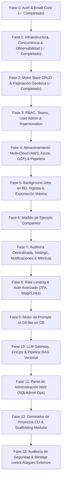

# 🗺️ Master Roadmap & Arquitectura: `fastapi_plantilla`

Este documento define la hoja de ruta, arquitectura de módulos y especificaciones técnicas para el desarrollo completo de `fastapi_plantilla` (backend modular de alto rendimiento para proyectos empresariales CRUD + IA).

---

## 🏛️ 1. Principios de Diseño & Estándares Técnicos

1. **Filosofía Ponytail (Simplicidad Radical & Cero Grasa):** 
   - Biblioteca estándar y capacidades nativas de PostgreSQL primero.
   - Sin sobreingeniería, sin factories innecesarias ni dependencias pesadas.
2. **Código Autoexplicativo & Cero Grasa Documental (No Sobreexplicar):**
   - El código debe ser limpio, directo y autoexplicativo a través de sus nombres, tipos y estructura.
   - Evitar comentarios obvios, redundancias y descripciones innecesarias en esquemas y campos cuando el nombre ya es explícito.
3. **Polimorfismo Universal (`entity_type` + `entity_id`):** 
   - Patrón único y consistente para vincular Documentos S3, Papelera, Logs de Auditoría, Notificaciones y Plantillas de Prompts IA a cualquier entidad de negocio sin acoplamientos rígidos.
4. **Calidad & Robustez:**
   - **Tipado estricto:** 100% verificado con Mypy estricto.
   - **Linter & Formatter:** Ruff.
   - **Seguridad:** Hashing Argon2id, HMAC-SHA256 en tiempo constante, sesiones en BD y compatibilidad total con SSR (Cookies `HttpOnly` + Bearer Tokens).
   - **Base de Datos:** SQLAlchemy 2.0 Asíncrono + UUIDv7 nativos + Alembic migrations.
5. **Código Preparatorio Inter-Fases (Tolerancia a Código Latente):**
   - Se permite la existencia de esquemas, tipos o dependencias auxiliares de preparación (ej. `WriteOptions`, `get_write_options`, `ExportRequest`) que serán consumidos plenamente en fases posteriores (como exportación masiva o auditoría centralizada en BD), siempre que estén estrictamente tipados y no interfieran con la lógica de la fase en curso.

---

## 📊 2. Diagrama de Fases y Dependencias

---

## 📋 3. Desglose Detallado de Fases

### 🟢 FASE 0: Autenticación Base & Email Engine *(COMPLETADO)*
* **Descripción:** Registro/Login por email, Google OAuth OIDC, reseteo/verificación de correo, sesiones en BD con HMAC-SHA256, cookies HttpOnly SSR y motor de emails (Builder fluido + Jinja2 + Transports SMTP/Resend).
* **Modelos:** `auth_users`, `auth_accounts`, `auth_sessions`, `auth_verifications`.
* **Problema que soluciona:** Proporciona la identidad segura del usuario y la comunicación por correo sin frameworks pesados de terceros.

---

### 🟢 FASE 1: Infraestructura Transversal, Observabilidad & Concurrencia *(COMPLETADO)*
* **1.1 Middleware Request ID Tracing (`X-Request-ID`):**
  * *Descripción:* Inyección de UUIDv7 en cada request propagado a logs, auditoría y headers de respuesta.
  * *Problema que soluciona:* Elimina el caos en producción al depurar errores; vincula cualquier fallo HTTP a una traza única de base de datos e IA.
* **1.2 Healthchecks Inteligentes (Liveness & Readiness Probes):**
  * *Descripción:* Endpoints `/api/health/live` (proceso vivo) y `/api/health/ready` (ping con timeout a PostgreSQL).
  * *Problema que soluciona:* Los orquestadores (Docker / Kubernetes / Render) sabrán exactamente si la app está lista para recibir tráfico o si la base de datos se cayó.
* **1.3 Mixins Comunes & Concurrencia Optimista:**
  * *Descripción:* `RecordStatus` enum (`ACTIVE`, `PENDING`, `TRASHED`, `INACTIVE`, `ARCHIVED`, `SUSPENDED`), `TimestampMixin`, `AuditFieldsMixin`, `OptimisticLockMixin` (`version: int`), `OwnedMixin` y `PolymorphicTargetMixin`.
  * *Problema que soluciona:* Evita que dos usuarios modifiquen el mismo registro al mismo tiempo y se pisen cambios sin advertencia (`HTTP 409 Conflict`), estandarizando el modelo de datos.

---

### 🟢 FASE 2: Capa Base CRUD & Paginación Genérica (Core Engine) *(COMPLETADO)*
* **2.1 Servicios y Repositorios Genéricos:** *(COMPLETADO)*
  * *Descripción:* `BaseRepository[T]`, `BaseCRUDService[T]`, `BaseAuditService[T]` y `BaseOwnedService[T]` sobre SQLAlchemy 2.0 asíncrono con blindaje de seguridad completo (Fail-closed RBAC, anti-oráculo 404, mitigación DoS y mass assignment).
  * *Problema que soluciona:* Evita escribir el 80% del código boilerplate en nuevos módulos garantizando aislamiento multitenant.
* **2.2 Paginación y Envelopes Estándar:** *(COMPLETADO)*
  * *Descripción:* `PaginationParams` y `PaginatedResponse[T]` con metadatos: `{ data: [...], meta: { page, limit, total, totalPages, hasNext, hasPrev } }` y límites anti-DoS (`page <= 1000`, `search <= 100`).
  * *Problema que soluciona:* Homogeniza todas las respuestas de listas para que los frontends (Next.js, React, Vue, Svelte) consuman una sola estructura predecible.
* **2.3 Base Router Factory (FastAPI Router Generator):** *(COMPLETADO)*
  * *Descripción:* Generador dinámico de rutas estándar: CRUD individual, operaciones `/bulk` (crear, soft-delete, restore, permanent) y `/list` ultraligero para dropdowns con esquemas Pydantic explícitos y ScopeContext multi-tenant.
  * *Problema que soluciona:* Crear una nueva entidad de negocio pasa de requerir días a tomar menos de 10 minutos.

---

### 🔐 FASE 3: Sistema RBAC, Equipos (Teams), Usuarios & Impersonation
* **3.1 Catálogo de Módulos & Roles (`sys_modules`, `rbac_roles`, `rbac_role_permissions`):**
  * *Descripción:* Matriz de permisos con 8 acciones (`CREATE`, `READ`, `UPDATE`, `DELETE`, `RESTORE`, `EXPORT`, `IMPORT`, `SETTINGS`) y 3 scopes jerárquicos (`GLOBAL` > `TEAM` > `OWN`).
  * *Problema que soluciona:* Control de acceso granular empresarial y multitenant dinámico en base de datos.
* **3.2 Módulo de Equipos (`modules/team`):**
  * *Descripción:* Modelos `Team` y `TeamUser`. Gestión de miembros y asignación polimórfica de roles a equipos completos.
  * *Problema que soluciona:* Facilita la colaboración corporativa; un usuario hereda automáticamente los permisos de todos sus equipos.
* **3.3 Gestión Administrativa de Usuarios (`modules/users`):**
  * *Descripción:* Listado paginado, suspensión/reactivación individual y masiva (`/bulk/suspend`), asignación de roles y reenvío de invitaciones.
  * *Problema que soluciona:* Panel de control completo para gobernar cuentas de usuario.
* **3.4 Impersonation ("Login As" para Soporte):**
  * *Descripción:* Endpoint `POST /api/auth/impersonate/{user_id}` para SuperAdmins con auditoría estricta.
  * *Problema que soluciona:* Permite a soporte técnico ver exactamente lo que ve un usuario para reproducir errores sin pedirle su contraseña.

---

### 📁 FASE 4: Almacenamiento Multi-Cloud (AWS S3, Azure Blob, Google Cloud Storage) & Papelera Unificada
* **4.1 Interface Agnóstica de Almacenamiento (`StorageProvider` Protocol):**
  * *Descripción:* Protocolo/Interface estándar (`upload`, `download`, `get_presigned_url`, `delete`, `exists`) con implementaciones intercambiables e interoperables según conveniencia del cliente o infraestructura disponible (`AWS S3 / MinIO`, `Azure Blob Storage`, `Google Cloud Storage (GCS)` y `Local/Mock` para tests).
  * *Problema que soluciona:* Cero vendor lock-in con proveedores cloud; la aplicación puede ejecutarse indistintamente en Azure, AWS o Google Cloud simplemente ajustando una variable de configuración en `.env` sin cambiar una sola línea de código de negocio.
* **4.2 Módulo de Documentos Polimórficos (`modules/storage`):**
  * *Descripción:* Modelo polimórfico `Document` (`entity_type`, `entity_id`). Generación de Presigned URLs (Upload/Download directo al bucket), confirmación de subida, metadatos MIME/tamaño y descarga empaquetada en ZIP.
  * *Problema que soluciona:* Carga y descarga de archivos de alto rendimiento sin saturar la memoria ni el ancho de banda del servidor FastAPI.
* **4.3 Papelera de Reciclaje Centralizada (`modules/trash`):**
  * *Descripción:* Modelo `sys_trash_bin` con retención temporal (`expires_at`, ej. 30 días), vista unificada de elementos borrados en cualquier módulo, restauración individual/masiva y purga definitiva.
  * *Problema que soluciona:* Recuperación uniforme de desastres ante borrados accidentales de usuarios.
* **4.4 Background Trash Purge Job:**
  * *Descripción:* Lifespan scheduler periódico (cada 24h) para purga automática de registros caducados.
  * *Problema que soluciona:* Mantenimiento automático de la base de datos sin acumular basura residual.

---

### 📊 FASE 5: Background Jobs en PostgreSQL, Ingesta & Exportación Masiva (CSV & Excel)
* **5.1 Motor de Tareas en Segundo Plano (`sys_jobs` con `SKIP LOCKED`):**
  * *Descripción:* Cola de trabajos asíncronos nativa en PostgreSQL sin dependencias pesadas (cero Redis, cero Celery). Seguimiento en tiempo real (`progress: 0..100%`), estados (`PENDING`, `RUNNING`, `COMPLETED`, `FAILED`), reintentos automáticos, y endpoints de consulta (`GET /api/jobs/{id}`) y cancelación.
  * *Problema que soluciona:* Evita caídas por `HTTP 504 Gateway Timeout` al procesar archivos masivos, generar ZIPs de storage o ejecutar exportaciones pesadas sin bloquear el hilo de la API.
* **5.2 Motor de Exportación Avanzada:**
  * *Descripción:* Conversor a CSV y `.xlsx` (OpenPyXL) ejecutado en background job para grandes volúmenes o streaming directo para tamaños moderados, con resolución de caminos anidados (ej. `team.name`), selección de columnas y headers `Content-Disposition`.
  * *Problema que soluciona:* Permite descargar cualquier tabla filtrada en tiempo real sin librerías frontend pesadas ni sobrecargar memoria.
* **5.3 Importador Masivo con Validación Fila por Fila:**
  * *Descripción:* `GET /{resource}/import-template` (descarga de plantilla Excel con tipos esperados) y `POST /{resource}/import` (encolado en `sys_jobs` para validación fila por fila contra esquemas Pydantic con reporte detallado de errores).
  * *Problema que soluciona:* Ingesta masiva segura de datos para clientes, devolviendo reportes de errores claros (*"Fila 12: NIF inválido"*).

---

### 🏢 FASE 6: Módulo de Ejemplo de Negocio (`modules/companies`)
* **6.1 Entidad `Company`:**
  * *Descripción:* Implementación de referencia completa con `name`, `nif`, `sector`, `owner_id`, `status` y auditoría completa.
  * *Problema que soluciona:* Valida en un caso de negocio real la integración completa de todas las capas anteriores: CRUD genérico, permisos y scopes RBAC, almacenamiento multi-cloud de documentos adjuntos, papelera y exportación/importación masiva.

---

### 📋 FASE 7: Auditoría Centralizada, Settings Dinámicos, Notificaciones & Métricas Prometheus
* **7.1 Módulo de Auditoría (`modules/audit`):**
  * *Descripción:* Tabla `sys_audit_logs` con registro de acciones (`CREATE`, `UPDATE`, `LOGIN`, etc.), diffs `before`/`after`, IP, User-Agent y ofuscación de datos sensibles (`[REDACTED]`).
  * *Problema que soluciona:* Cumplimiento de normativas de seguridad (ISO 27001 / GDPR) y trazabilidad completa de cambios.
* **7.2 Settings Dinámicos & Feature Flags (`sys_settings`):**
  * *Descripción:* Configuración clave-valor en BD con scopes (`GLOBAL` o por `entity_type`/`entity_id`).
  * *Problema que soluciona:* Modificar parámetros (modo mantenimiento, límites de tamaño, activar betas) en caliente sin redeploy.
* **7.3 Notificaciones In-App (`sys_notifications`):**
  * *Descripción:* Campanita 🔔 de notificaciones polimórficas (`entity_type`, `entity_id`) para eventos asíncronos o alertas.
  * *Problema que soluciona:* Avisar al usuario cuando terminan procesos largos (exportación lista, documento procesado por IA).
* **7.4 Métricas Operativas Prometheus (`/metrics`) & Salud del Pool:**
  * *Descripción:* Endpoint estándar `/metrics` (formato OpenMetrics/Prometheus) para telemetría en tiempo real: peticiones por segundo, latencias p50/p95/p99 por endpoint, conteo de respuestas por código de estado (2xx, 4xx, 5xx) y saturación del connection pool de SQLAlchemy.
  * *Problema que soluciona:* Observabilidad proactiva para alertar ante degradación del rendimiento o agotamiento del pool de base de datos antes de que ocurra una caída.

---

## 🛡️ FASE 8: Seguridad Global & Autenticación Avanzada
* **8.1 Rate Limiting Global & Security Headers:**
  * *Descripción:* Limitador de peticiones anti-fuerza bruta en login y endpoints sensibles + cabeceras de seguridad HTTP (HSTS, CSP, etc.).
  * *Problema que soluciona:* Protección contra ataques DoS y scraping malicioso.
* **8.2 Magic Links (Passwordless Login):**
  * *Descripción:* Flujo de login por enlace temporal directo al correo sin contraseña.
  * *Problema que soluciona:* Experiencia de usuario ágil y moderna.
* **8.3 Doble Factor de Autenticación (2FA / TOTP):**
  * *Descripción:* Códigos QR con `pyotp` para Google Authenticator / Authy + códigos de recuperación.
  * *Problema que soluciona:* Seguridad de grado corporativo para cuentas críticas y administradores.
* **8.4 API Keys & Email Logs:**
  * *Descripción:* Modelo `Key` para integración programática con scripts externos + tabla `email_logs` para auditar envíos.
  * *Problema que soluciona:* Interoperabilidad B2B y diagnóstico de correos rebotados o fallidos.

---

### 🧠 FASE 9: Motor de Prompts IA en DB con Versionado Git (`modules/ai_prompts`)
* **9.1 Plantillas Polimórficas (`ai_prompt_templates`):**
  * *Descripción:* Registro con `slug`, `category`, `entity_type` y `entity_id`. Soporta resolución en cascada (busca el prompt específico de la Entidad/Compañía y si no existe, cae al `GLOBAL` default).
  * *Problema que soluciona:* Permite tener comportamientos de IA personalizados por cliente (ej. un OCR diferente por empresa) sin tocar código.
* **9.2 Versiones Inmutables Tipo Git (`ai_prompt_versions`):**
  * *Descripción:* Commits de prompts con `system_prompt`, `user_prompt`, `few_shot_examples`, `commit_message`, estados (`DRAFT`, `ACTIVE`, `ARCHIVED`), endpoint de **Diff** y endpoint de **Rollback**.
  * *Problema que soluciona:* Control de versiones, pruebas seguras de prompts desde el frontend y capacidad de volver atrás al instante si un prompt empeora.
* **9.3 Trazabilidad y Auditoría de Ejecuciones (`sys_ai_executions`):**
  * *Descripción:* Registro de cada llamada al LLM vinculando la versión exacta del prompt, variables inyectadas, modelo, latencia, tokens, coste (\$ USD) y salida estructurada.
  * *Problema que soluciona:* Trazabilidad absoluta de por qué la IA respondió lo que respondió y auditoría de costes.

---

### ⚡ FASE 10: LLM Multi-Provider Gateway, FinOps & Pipeline RAG Vectorial (`modules/ai_engine`)
* **10.1 Gateway Agnóstico de LLMs con Pydantic Structured Outputs:**
  * *Descripción:* Conector unificado para Google Gemini, OpenAI, Anthropic y Ollama/DeepSeek con reintentos y fallback automático. Salidas 100% tipadas en esquemas Pydantic.
  * *Problema que soluciona:* Cero dependencia de un solo proveedor de IA y respuestas garantizadas en formato JSON válido.
* **10.2 FinOps & Control de Cuotas de IA:**
  * *Descripción:* Límites mensuales de gasto/tokens configurables por Empresa o Equipo.
  * *Problema que soluciona:* Previene facturas sorpresa de OpenAI/Gemini por bucles o abusos.
* **10.3 Pipeline de Ingesta, Extracción de Texto & Chunking Semántico:**
  * *Descripción:* Servicio desacoplado `DocumentParserService` que extrae texto estructurado desde documentos almacenados (`modules/storage`, formatos PDF, DOCX, TXT, Markdown) y genera particiones semánticas (*chunks*) con solapamiento configurable en la tabla `ai_document_chunks`.
  * *Problema que soluciona:* Resuelve el eslabón imprescindible entre el almacenamiento de archivos y la búsqueda semántica vectorial sin requerir frameworks pesados externos.
* **10.4 Soporte Vectorial Nativo para RAG (`pgvector`):**
  * *Descripción:* Extensión `pgvector` en PostgreSQL para almacenar embeddings de los chunks de documentos y realizar búsquedas por similitud coseno / distancia euclídea directamente desde SQL.
  * *Problema que soluciona:* Implementar RAG (chatear con documentos y bases de conocimiento) directamente en la misma base de datos sin costes ni complejidad de servicios vectoriales externos (Pinecone, Qdrant, etc.).

---

### 🎛️ FASE 11: Panel de Administración Web Interno (SQLAdmin Ops Nativo)
* **11.1 Integración Nativa con SQLAdmin (`sqladmin`):**
  * *Descripción:* Montaje de `Admin(app, engine, authentication_backend=...)` directamente en la aplicación FastAPI en el mismo proceso ASGI. Reutilización directa del 100% de los modelos existentes de SQLAlchemy 2.0 (`User`, `Account`, `Session`, `Document`, `PromptTemplate`, `AuditLog`, etc.) con interfaz moderna responsiva (Tabler UI) y cero duplicación de modelos.
  * *Problema que soluciona:* Otorga un panel de control y observabilidad completo, visual y seguro para el equipo de desarrollo directamente sobre los modelos SQLAlchemy y la base de datos existente, eliminando la necesidad de construir un frontend administrativo desde cero o añadir capas intermedias innecesarias (filosofía Ponytail).
* **11.2 Autenticación & Protección Administrativa (`AuthenticationBackend`):**
  * *Descripción:* Backend de login administrativo reutilizando el sistema de hashing Argon2id y sesiones en BD de la plantilla, restringido exclusivamente a usuarios con `is_super_admin=True` y protegido con cookies de sesión HTTPOnly dedicadas.
  * *Problema que soluciona:* Garantiza que solo los superadministradores puedan acceder a `/admin` sin introducir sistemas de autenticación paralelos.
* **11.3 Monitoreo de Usuarios, Cuentas & Sesiones Activas:**
  * *Descripción:* Vistas de modelo (`ModelView`) para `User`, `Account` y `Session` con búsqueda por email/nombre, filtros por estado (`RecordStatus`) y acción administrativa (`@action`) para invalidación y revocación forzada de sesiones comprometidas.
  * *Problema que soluciona:* Permite al equipo de desarrollo y soporte auditar accesos en tiempo real y expulsar sesiones sospechosas al instante.
* **11.4 Inspección de Almacenamiento S3 & Papelera de Reciclaje:**
  * *Descripción:* Vistas administrativas para `Document` (tamaños, tipos MIME, URLs temporales de previsualización) y `TrashBin` (registros borrados, fechas de expiración y acción de restauración o purga manual).
  * *Problema que soluciona:* Diagnosticar ficheros corruptos, ver qué suben los clientes y gestionar la papelera visualmente.
* **11.5 Visor Forense de Auditoría, Logs & Correos:**
  * *Descripción:* Búsquedas y filtros avanzados sobre `sys_audit_logs` (filtrar por usuario, acción, IP, User-Agent, diffs JSON `before`/`after`) y trazabilidad de correos enviados (`email_logs`).
  * *Problema que soluciona:* Diagnóstico inmediato de incidentes en producción ("¿quién borró este registro y desde qué IP?") y trazabilidad de emails rebotados o no entregados.
* **11.6 Observabilidad de Prompts IA & Trazabilidad de Costes (FinOps):**
  * *Descripción:* Navegación por plantillas de prompts (`ai_prompt_templates`, `ai_prompt_versions`) con historial de versiones y monitor de ejecuciones de LLMs (`sys_ai_executions`) con desglose de latencias, tokens y coste (\$ USD).
  * *Problema que soluciona:* Visibilidad total para el equipo técnico sobre qué prompts están fallando, cuánto dinero se está gastando en OpenAI/Gemini y qué modelos son más eficientes.
* **11.7 Configuración Dinámica (`sys_settings`) & Acciones Operativas:**
  * *Descripción:* Edición de feature flags y settings en caliente sin redeploy + acciones masivas personalizadas (`@action`) para tareas de mantenimiento rutinario.
  * *Problema que soluciona:* Operar y mantener la plataforma en producción de forma ágil sin tener que lanzar queries SQL manuales a la base de datos de producción.

---

### 🏗️ FASE 12: Generador de Proyectos CLI & Scaffolding Modular (Template Wizard & Seeders)
* **12.1 Asistente Interactivo de Inicialización (`fastapi-plantilla init` / Project Wizard):**
  * *Descripción:* CLI interactivo tipo asistente (estilo generador oficial de FastAPI / Copier / Typer) que permite instanciar un nuevo proyecto derivado de la plantilla configurando interactivamente:
    - *Motor de Base de Datos:* PostgreSQL nativo asíncrono (predeterminado) o SQLite (para prototipos rápidos y testing local sin infraestructura externa).
    - *Módulos de Inteligencia Artificial:* Posibilidad de incluir la suite completa de IA (Prompts Git-like, LLM Gateway, FinOps y RAG pgvector) o podarla al 100%, generando un backend limpio y ultra liviano estrictamente CRUD sin librerías de IA ni dependencias no deseadas.
    - *Proveedores de Storage:* Soporte Multi-Cloud (S3, Azure Blob, GCS) o únicamente almacenamiento local en disco (`LocalDiskProvider`).
    - *Panel Web de Administración:* Incluir o excluir SQLAdmin Ops.
    - *Autenticación:* Selección de mecanismos deseados (cookies HttpOnly SSR, Bearer JWT, Google OAuth OIDC o Magic Links).
  * *Problema que soluciona:* Convierte la plantilla en una factoría modular viva, permitiendo a cualquier equipo generar un nuevo proyecto a medida en segundos eliminando de raíz el código muerto y la sobreingeniería de módulos no utilizados (filosofía Ponytail).
* **12.2 CLI de Operaciones del Proyecto (`fastapi_plantilla.cli`):**
  * *Descripción:* Punto de entrada unificado por línea de comandos para tareas de despliegue y mantenimiento de la aplicación generada: creación del primer superadministrador (`create-superadmin`), comprobación de estado de servicios y utilidades operativas.
  * *Problema que soluciona:* Elimina la necesidad de scripts ad-hoc o queries manuales para inicializar y operar el backend en entornos de desarrollo, staging y producción.
* **12.3 Motor de Seeders & Fixtures Configurables:**
  * *Descripción:* Comandos `seed-rbac` (siembra de módulos y permisos base del sistema) y `seed-demo` (generación de datos sintéticos realistas de empresas, usuarios, sesiones y documentos para demos y pruebas de carga).
  * *Problema que soluciona:* Permite a nuevos desarrolladores arrancar el entorno en local con datos realistas en segundos y facilita las pruebas end-to-end automatizadas.

---

### 🛡️ FASE 13: Auditoría de Seguridad Global & Blindaje contra Ataques Externos
* **13.1 Blindaje OWASP API Security Top 10:**
  * *Descripción:* Verificación y endurecimiento exhaustivo contra BOLA/IDOR (Broken Object Level Authorization), Broken Authentication, Mass Assignment (filtrado estricto de campos no editables), DoS por consumo desmedido de recursos (payloads masivos, regex complejas, límites de queries), BFLA (Broken Function Level Authorization), y SSRF en descargas o conectores externos.
  * *Problema que soluciona:* Garantiza que el backend resista de forma sistemática y verificada los 10 vectores de ataque más críticos en APIs empresariales antes de salir a producción.
* **13.2 Hardening Perimetral, Cabeceras HTTP & Prevención SSRF:**
  * *Descripción:* Configuración y auditoría estricta de políticas CORS, Content Security Policy (CSP), HSTS con preload, `X-Content-Type-Options: nosniff`, `X-Frame-Options: DENY`, `Referrer-Policy: strict-origin-when-cross-origin`. Bloqueo activo de IPs privadas/reservadas (RFC 1918, metadata de cloud `169.254.169.254`, loopback) en cualquier petición saliente del servidor o webhooks para mitigar SSRF.
  * *Problema que soluciona:* Previene ataques man-in-the-middle, clickjacking, fugas de metadatos de instancias cloud (AWS/GCP/Azure) y accesos no autorizados a servicios de la red privada interna.
* **13.3 Pipeline Automatizado de SAST, DAST & Auditoría de Dependencias:**
  * *Descripción:* Integración de herramientas de análisis estático de seguridad (`bandit`, `semgrep`), auditoría continua de vulnerabilidades en dependencias Python (`pip-audit`), y escaneo de secretos o credenciales expuestas (`detect-secrets`).
  * *Problema que soluciona:* Detecta vulnerabilidades conocidas (CVEs), malas prácticas criptográficas y fugas de tokens en el código antes de que lleguen a la rama principal.
* **13.4 Batería de Pruebas de Intrusión (Simulated Attack Test Suite):**
  * *Descripción:* Suite de tests automatizados dedicados (`tests/security/`) que simulan activamente ataques externos: inyecciones SQL/NoSQL en parámetros de búsqueda, manipulación maliciosa de cabeceras (`Host`, `X-Forwarded-For`), parameter pollution, evasión de rate limiting, falsificación/manipulación de firmas de sesión y flooding de payloads anormales.
  * *Problema que soluciona:* Certifica mediante tests en CI/CD que las defensas perimetrales no se degraden con el tiempo ni se introduzcan regresiones de seguridad en futuros desarrollos.
